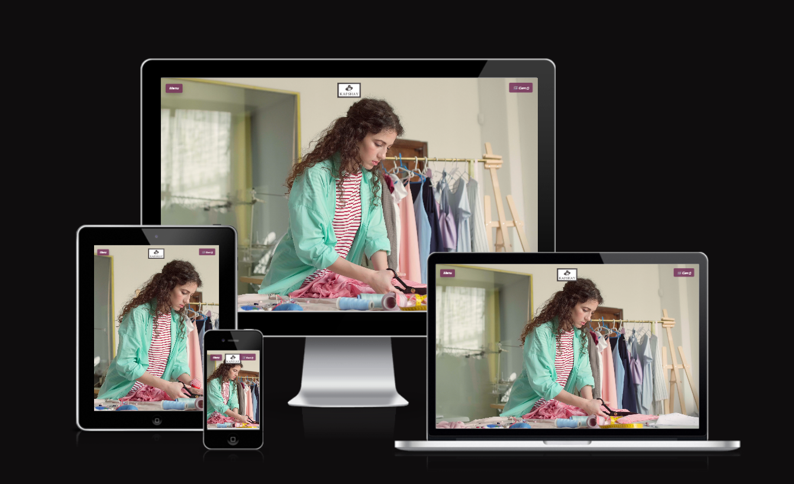

# **Kafshay Collection**

# Table of Contents
1. [Introduction](#introduction)
2. [Purpose](#purpose)
3. [Deployment](#deployment)
4. [User-Experience](#user-experience)
5. [Design](#design)
6. [Colour-Scheme](#colour-scheme)
7. [Typography](#typography)
8. [Imagery](#imagery)
9. [Testing](#testing)
10. [Programme-used](#programme-used)

# Introduction
- Welcome to [Kafshay](https://kafshay-d69b561b1669.herokuapp.com/),  This website is responsive on all devices.The Django-powered ecommerce platform which is responsible to provide you smooth shopping experience, fully-featured e-commerce website designed to deliver an enjoyable shopping experience for customers while offering a comprehensive administration system for managing products. The site is split into two major parts: one for regular users (customers) and another for administrators.

## For Customers
#### Product Exploration:
- Users can view a list of products effortlessly. The site showcases detailed product pages with images, prices, and descriptions.
#### Cart Functionality:
- Customers can add products to their cart, update product quantities, or remove products as needed. The intuitive cart ensures a smooth shopping journey.
#### Secure Checkout:
- Once the selection is made, users can proceed to a secure checkout. The flow ensures that customer data and payment information are handled safely.
#### User Account Management:
- A dedicated sign-in button is located in the site's menu. If a customer does not already have an account, they can easily sign up. Once registered, they can log in to view their manage their cart and order 

## For Administration
#### Admin Panel Access:
- An integrated admin panel is accessible via a menu button on the index.html page. Administrators can log in securely using their credentials.
#### Product Management:
- Once logged in, administrators have access to Django’s built-in Admin interface. From there, they can create, update, or delete products displayed on the website. This powerful backend makes it easy to manage inventory, update product details, and control the overall content of the store.

## Key Feature
  1. Admin and user authentication  
  2. Admin panel for managing products & orders
  3. Shopping cart functionality (Add, remove, update items)
  4. Checkout with shipping address and payment 
  5. order success message with order number

  ### Website 
- [signup.html](store/static/store/images/products/signup.html.png)
- [signin.html](store/static/store/images/products/signin.html.png)  
- [index.html](store/static/store/images/products/index.html.png)
- [productlist.html](store/static/store/images/products/productlist.html.png)
- [buy_product.html](store/static/store/images/products/buy_product.html.png)
- [cart.html](store/static/store/images/products/cart.html.png)
- [checkout.html](store/static/store/images/products/checkout.html.png)
- [order_success.html](store/static/store/images/products/order_success.html.png)

# Purpose
- The purpose of this website is to enhance the product sale by attracting user. It has user-friendly features to ensure a seamless and enjoyable shopping experience.
- Website has eye catching visuals to attarct users. Clear and high resolution pictures of an actual product encourages user to purchase. 
- Website serves a meaningful purpose by catering to individuals with sensitive skin, allergies, or personal preferences for natural fabrics.
- This website eliminate the hassle of filtering through synthetic options, ensuring a straightforward, stress-free shopping experience for those who prioritize comfort, breathability, and natural fibers.

# Github Deployment
 1. Login to GitHub
 2. From the list of the repositories on the screen, select Ecommerce_website
 3. From the menu items near the top of the page, select settings
 4. Scroll down to the GitHub Pages section
 5. Under source click the drop-down menu labelled Name and select Master Branch
 6. On selecting Master Branch, the page is automatically refreshed, and the website is now deployed.
 7. At the moment of submitting the project, the Development Branch and Master Branch are identical.

## How to Run the Project Locally
1. A Github account. Create a Github Account [here](https://github.com join)
2. Use the Chrome browser then follow these steps:
   - Install the Gitpod Browser Extension for Chrome
   - After installation, restart the browser
   - Log into Gitpod with your Gitpod account
   - Navigate to the Project Github repository
   - Click the green "Gitpod" button in the top right corner of the repository
   - This will trigger a new Gitpod workspace to be created from the code in Github where you can work locally.
3. To work on the project code within a local IBE such as VSCode, Pycharm, etc.
   - Follow the link to the Project Repository
   - Under the repository name, click "clone or download".
   - In the clone with HTTPs section, copy the clone URL for the repository
   - In your local IBE, open the terminal
   - Change the current working directory to the location where you want the cloned directory to be made.
   - Type `git clone`, and then paste the URL you copied in Step 3:   `https://github.com/Farah-94/Ecommerce_website.git`
   - Press Enter. Your local clone will be created.

# Heroku Deployment
1. Login to Heroku.
2. In your Heroku dashboard, click "New" and then "Create new app".
3. Provide a unique name for your app (e.g., Kafshay) and choose your region.
4. Go to the "Resources" tab within your Heroku app.
5. Under Dynos, select the appropriate plan. Heroku’s Eco Dynos help you stay within a low-cost, sustainable usage model.

#### Connect your app to Github
1. Navigate to the "Deploy" tab in your Heroku app dashboard.
2. If prompted, connect your GitHub account.
3. Write in the search "Ecommerce_website".  
4. Once found, click "Connect" to link your repository.
5. After linking, scroll down in the Deploy section.
6. Click on the automatic deploy( automatic update after pushing code to github).
7. Click "Deploy Branch" to manually deploy your current branch.
8. Review the build logs to ensure that the deployment completes successfully.
9. https://git.heroku.com/kafshay.git git url created. 

# User Experience 
# User Experience
  ## User stories
   * First-time Visitor 
     - For first-time visitors, we aim to make your initial interaction smooth and intuitive.
     - The website is designed with a straightforward layout, making it easy to explore and easy to understand.
     - Users can find their expected results without any hassel.
     - Users can view products in latest items.  
     - Users can see product details by clicking the product card.
     - Users will be able to select sizes ranging from small medium to large, set the quanty and add the product in cart. 
     - Users can adjust quantities or remove items as needed, ensuring a flexible and user-friendly shopping experience.
     - Users can proceeds and go to the checkout, where they need to fill out shiiping and payment form. 
     - Users can see the order successfull screen message with order number after completing order. 

   * Return Visitor 
     - For return visitors, we focus on advertising products in more efficient ways.   
     -  Stay informed with the latest products and special discount offers.
   
 
   * Visitor Goals
     - Enable users to add products to their cart, update quantities, and remove items seamlessly, ensuring that managing their selections is both straightforward and efficient.
     - Provide a secure, simple checkout process to build trust and ensure that every completed purchase is effortless.
     - For frequent visitors, the site highlights the latest products and exclusive discount offers, ensuring that they stay informed and enjoy a tailored shopping experience.
      - Simplify account creation and sign-in processes so that visitors can easily register, log in, and track their orders, further enhancing their engagement with our platform.

# Design
 * Simplicity
     - We maintain a clean and simple design to enhance usability.
 * Accessibility
     - We ensure that our design is accessible to all users, including those with disabilities.
 * Layout 
     - Our layout is designed to be responsive and adaptable to different screen sizes.
     - We use a flexible design to ensure content is well-organized and easy to navigate.
 * Responsive Design
     - The website is optimized for both desktop and mobile devices, providing a seamless experience across all platforms.
 * Language used 
     - **django**, **python**, **HTML**, **CSS** and **JavaScript**
   

# wireframes
- [index](https://www.figma.com/design/TePdKQ0tgqDsgnzpgoiR7m/kafshay?node-id=0-1&t=c3ualIQJnAK3Sk7y-1)
- [productlist](https://www.figma.com/design/TePdKQ0tgqDsgnzpgoiR7m/kafshay?node-id=2-10&t=c3ualIQJnAK3Sk7y-1)
- [buy_product](https://www.figma.com/design/TePdKQ0tgqDsgnzpgoiR7m/kafshay?node-id=2-11&t=c3ualIQJnAK3Sk7y-1)
- [cart](https://www.figma.com/design/97qTMXYs2Uiv1bX9iuBfS1/kafshay_remaing-pages?node-id=0-1&t=HZvnGS3Sa2e4d5HV-1)
- [checkout](https://www.figma.com/design/97qTMXYs2Uiv1bX9iuBfS1/kafshay_remaing-pages?node-id=1-38&t=HZvnGS3Sa2e4d5HV-1)
- [order_success](https://www.figma.com/design/97qTMXYs2Uiv1bX9iuBfS1/kafshay_remaing-pages?node-id=1-85&t=HZvnGS3Sa2e4d5HV-1)

# Colour Scheme
 *  index.html 
    - header has a logo with the colour combination of grey and white. 
    - header has menu and cart with the colour rgba(112, 41, 85, 0.8); 
    - footer background-colour : transperant
    - footer content colour :rgb(79, 17, 66);   

 * productlist.html
    - page background-color: white 
           
         
 * buy_product.html
    - page background-color: white 
   
 * cart.html
    - page background-color: white 

 * checkout.html 
    - page background-color: white

 * order_success.html
    - page background-color: white

* Imagery
  #### Logo
 - [logo](store/static/store/images/products/logo1.png)
 - [index page background](store/static/store/images/products/video1.mp4)
 - [productlist](store/static/store/images/products/tshirt.jpg) 

 # Testing 
   - [Test Plan](https://1drv.ms/w/c/e1af83f369e97fb7/Eel16z3ZXNpCupDJL3FzS3UBx07wiTjeCjkNx4OziEHMSg?e=RHglP9)

   ### HTML Validation
   - [index](store/static/store/images/products/index_kafshay%20validation.png)
   - [productlist](store/static/store/images/products/productlist_kafshay%20validation.png)
   - [buy_product](store/static/store/images/products/buy_product_kafshay%20validation.png)
   - [cart](store/static/store/images/products/cart_kafshay%20validation.png)
   - [checkout](store/static/store/images/products/checkout_kafshay%20validation.png)
   - [order_success](store/static/store/images/products/order_sucess_kafshay%20validation.png)

   ### Css Validation
   - [style](store/static/store/images/products/css_kafshay%20validation.png)

   ### JSHint
   - [script](store/static/store/images/products/jshint.png)

# Programme used
 1. [Google Fonts](https://fonts.google.com/)
 2. [githUb](https://github.com/)
 3. [Figma](https://www.figma.com/)
 4. [django -allauth](https://docs.allauth.org/en/latest/)
 5. [Freepik](https://www.freepik.com/) 
 6. [w3school](https://www.w3schools.com/)
 7. [Gantt Chart](https://create.microsoft.com/en-us/templates/gantt-charts)
 8. [W3C](https://validator.w3.org/)
 9. [Jestjs](https://jestjs.io/)

 ## Help used
 - W3school
 - Youtube
 - Codeinstitute
 - Online classes
 - Udemy